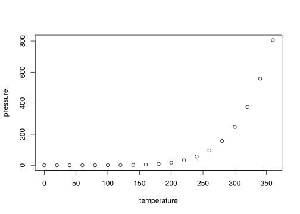
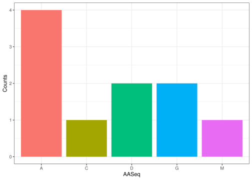

<!-- README.md is generated from README.Rmd. Please edit that file -->

# cDogma

<!-- badges: start -->
<!-- badges: end -->

The goal of cDogma is to …

## Installation

You can install the development version of cDogma from
[GitHub](https://github.com/) with:

``` r
# install.packages("devtools")
devtools::install_github("rforbiodatascience23/group_03_package")
```

## Example

This is a basic example which shows you how to solve a common problem:

``` r
library(cDogma)
## basic example code
```

What is special about using `README.Rmd` instead of just `README.md`?
You can include R chunks like so:

``` r
summary(cars)
#>      speed           dist       
#>  Min.   : 4.0   Min.   :  2.00  
#>  1st Qu.:12.0   1st Qu.: 26.00  
#>  Median :15.0   Median : 36.00  
#>  Mean   :15.4   Mean   : 42.98  
#>  3rd Qu.:19.0   3rd Qu.: 56.00  
#>  Max.   :25.0   Max.   :120.00
```

You’ll still need to render `README.Rmd` regularly, to keep `README.md`
up-to-date. `devtools::build_readme()` is handy for this.

You can also embed plots, for example:



In that case, don’t forget to commit and push the resulting figure
files, so they display on GitHub and CRAN.

## Description

The central_dogma package provides functions that enables you to
generate and convert a DNA sequence into RNA and further into an amino
acid sequence, thus following the central dogma. The distribution of
amino acids of the final amino acid sequence can be visualized in a bar
plot.

The package includes five functions:

- randomDNASeq
- dnaToRna
- seqToCodon
- codonsToAA
- plotFreqAA

### randomDNASeq

The randomDNAseq() function takes an input of an integer of choice and
returns a random DNA sequence of the given input length. In the code
below, a 20 bp long sequences is created.

``` r
set.seed(111)
randomDNASeq(20)
#> [1] "TGCGGAGAGCCTAAATCGCT"
```

### dnaToRna

The function dnaToRNA converts a DNA sequence (given as a string) to a
RNA transcript. In can be used in combination with randomDNAseq as seen
in the following example:

``` r
# Generate DNA sequence with 50 bp:
DNASeq <- randomDNASeq(50)
DNASeq
#> [1] "TACGCAGGAGAAGCAGGCCCTAACCGTTAAATCCACTTTCAAGAGCAAAC"
# Convert the sequence to a RNA sequence:
RNASeq <- dnaToRna(DNASeq)
RNASeq
#> [1] "UACGCAGGAGAAGCAGGCCCUAACCGUUAAAUCCACUUUCAAGAGCAAAC"
```

### seqToCodon

The function seqToCodon returns codons from input sequence. Furthermore,
we can decide the start position, hereby also defining the reading
frame. Let’s try the function out using the RNA sequence from previous
example starting a position 4:

``` r
codons <- seqToCodon(RNASeq, 4)
codons
#>  [1] "GCA" "GGA" "GAA" "GCA" "GGC" "CCU" "AAC" "CGU" "UAA" "AUC" "CAC" "UUU"
#> [13] "CAA" "GAG" "CAA"
```

### codonsToAA

It is also possible to translate a RNA sequence into the corresponding
amino acid sequence with codonsToAA. This function take as input a
vector of codons as the one generated before.

``` r
proteinSeq <- codonsToAA(codons)
proteinSeq
#> [1] "AGEAGPNR_IHFQEQ"
```

As seen from before, we find a “\_” in the sequence. This is the
encoding for the stop codons seen from codonTable:

``` r
codonTable
#> UUU UCU UAU UGU UUC UCC UAC UGC UUA UCA UAA UGA UUG UCG UAG UGG CUU CCU CAU CGU 
#> "F" "S" "Y" "C" "F" "S" "Y" "C" "L" "S" "_" "_" "L" "S" "_" "W" "L" "P" "H" "R" 
#> CUC CCC CAC CGC CUA CCA CAA CGA CUG CCG CAG CGG AUU ACU AAU AGU AUC ACC AAC AGC 
#> "L" "P" "H" "R" "L" "P" "Q" "R" "L" "P" "Q" "R" "I" "T" "N" "S" "I" "T" "N" "S" 
#> AUA ACA AAA AGA AUG ACG AAG AGG GUU GCU GAU GGU GUC GCC GAC GGC GUA GCA GAA GGA 
#> "I" "T" "K" "R" "M" "T" "K" "R" "V" "A" "D" "G" "V" "A" "D" "G" "V" "A" "E" "G" 
#> GUG GCG GAG GGG 
#> "V" "A" "E" "G"
```

### plotFreqAA

The function plotFreqAA will plot the amount of amino acids found in a
given protein sequence given as input to the function as a string. Here
is an example:

``` r
plotFreqAA(proteinSeq)
```


